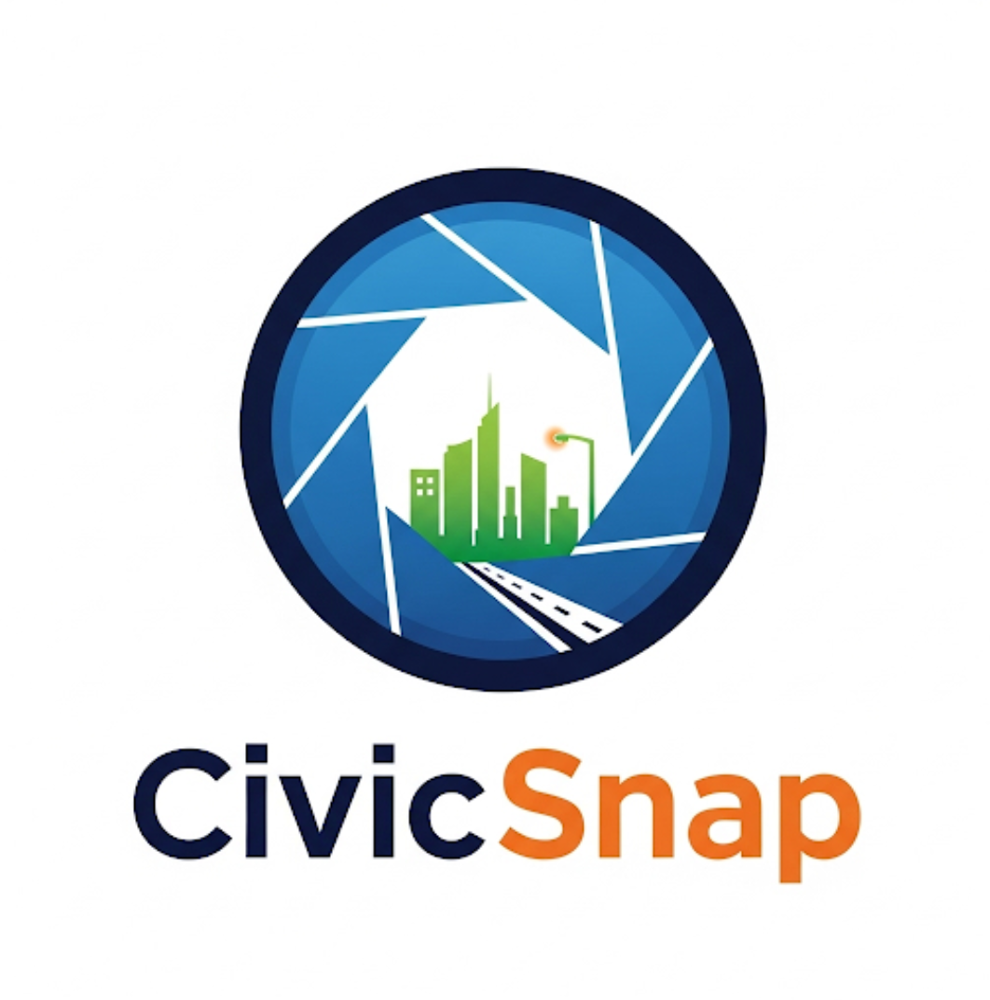

# CivicSnap (Android)

📱 **CivicSnap** is a mobile-first solution for crowdsourced civic issue reporting and resolution.  
Built for **Smart India Hackathon (SIH) 2025**, it empowers citizens to report real-world issues like potholes, garbage, or faulty streetlights with geotagged photos. Municipal authorities can then track, prioritize, and resolve them efficiently.

 <!-- Replace with actual app logo when available -->

[](https://flutter.dev)
[](https://firebase.google.com)
[](https://appwrite.io)

---

## 📌 SIH Problem Statement
- **Problem Statement ID:** 250031  
- **Problem Statement Title:** *Crowdsourced Civic Issue Reporting and Resolution System*  
- **Problem Description:** Create a mobile-based platform that allows citizens to report civic issues in their locality with photos, geo-tagging, and categorization. The system should efficiently route reports to appropriate municipal departments, track resolution status, and provide analytics on issue prevalence across regions.
- **Key Challenges to Address:**
  - Ensuring reports reach the correct authorities
  - Preventing duplicate/spam reports
  - Prioritizing issues by severity and impact
  - Making the system accessible to all citizens regardless of technical literacy

---

## 🚀 Features

### User-Facing Features
- Direct **camera capture** for issue reporting with image quality validation
- Auto-detect **latitude, longitude, and city** with reverse geocoding for address lookup
- Categorization of issues (pothole, garbage, streetlight, etc.) with intelligent suggestions
- Detailed **description** field for user input with multi-language support
- User-friendly **status tracking** of submitted reports
- Personalized **My Reports** section showing submission history
- **Multi-language support** for 10+ Indian languages including Hindi, Marathi, Gujarati, Tamil

### Technical Features
- **Firebase Authentication** with Google Sign-in integration
- **Cloud Firestore** for real-time database operations and user profiles
- **Appwrite Storage** for efficient and secure media uploads
- **Gemini AI integration** for report validation and priority assessment
- **Duplicate detection algorithm** (5m radius, same category, 24h window)
- **Geospatial indexing** for location-based queries
- **Responsive UI** adapting to different screen sizes and orientations

---

## 🛠️ Tech Stack

### Frontend
- **Framework:** Flutter SDK 3.9.2+
- **State Management:** Stateful Widgets with Service Pattern
- **Routing:** go_router (declarative navigation)
- **UI Components:** Material Design 3 with custom theming
- **Localization:** easy_localization with multi-language assets

### Backend & Services
- **Authentication:** Firebase Auth with Google Sign-in
- **Database:** Cloud Firestore (NoSQL)
- **Storage:** Appwrite for images & media uploads
- **Location Services:** Geolocator, Geocoding
- **AI/ML:** Gemini AI for content validation and prioritization
- **Media Handling:** image_picker for camera integration

### DevOps & Tooling
- **Version Control:** Git
- **Code Quality:** flutter_lints with custom analysis_options
- **Testing:** Flutter test framework for widget tests
- **CI/CD:** Manual deployment via Flutter CLI (Future: GitHub Actions)

---

## 📊 Future Enhancements

### For Citizens
- **Community engagement** features for upvoting and commenting on reports
- **Gamification elements** to incentivize active civic participation
- **Offline support** for areas with limited connectivity
- **Accessibility improvements** for users with disabilities

### For Authorities
- **Admin dashboard** for municipal authorities to manage and resolve issues
- **Analytics portal** with heatmaps and issue clustering visualization
- **AI-powered image similarity check** for enhanced duplicate detection
- **Automated severity assessment** of reported issues
- **Workforce management** for assigning field personnel to issues

### Technical Roadmap
- **Performance optimization** for low-end devices
- **End-to-end encryption** for sensitive report data
- **WebRTC integration** for live video reporting in critical situations
- **Blockchain integration** for transparent resolution tracking

---

## 🏗️ Code Architecture

### Directory Structure
```
lib/
├── components/       # Reusable UI widgets
├── config/           # Configuration files
├── models/           # Data models (Report, etc.)
├── pages/            # App screens and UI
│   ├── auth/         # Authentication screens
│   └── ...           # Other feature screens
├── router/           # Navigation configuration
├── services/         # Business logic and API services
└── themes/           # UI theming and styling
```

### Key Architecture Points
- **Service Pattern:** Business logic encapsulated in service classes
- **Repository Pattern:** Data access layer for Firebase/Appwrite
- **Router-based Navigation:** Declarative routing with go_router
- **Model-View Separation:** Clean separation of data models and UI

## 🚀 Getting Started

### Prerequisites
- Flutter SDK 3.9.2 or higher
- Android Studio / VS Code with Flutter extensions
- Firebase CLI for configuration
- Appwrite account with project setup

### Setup Instructions
1. Clone the repository
   ```bash
   git clone https://github.com/your-username/civicsnap_android.git
   cd civicsnap_android
   ```

2. Install dependencies
   ```bash
   flutter pub get
   ```

3. Configure Firebase (if not already set up)
   ```bash
   flutterfire configure
   ```

4. Create `.env` file with required API keys (see `.env.example`)

5. Run the application
   ```bash
   flutter run
   ```

## 📖 References
- [Flutter Documentation](https://docs.flutter.dev)
- [Appwrite Documentation](https://appwrite.io/docs)  
- [Firebase Authentication](https://firebase.google.com/docs/auth)  
- [Google Maps Platform](https://developers.google.com/maps)  
- [Smart India Hackathon (SIH)](https://www.sih.gov.in/)  
- [Gemini AI Documentation](https://ai.google.dev/docs)

## 🧪 Testing

### Running Tests
```bash
# Run all tests
flutter test

# Run a specific test file
flutter test test/widget_test.dart
```

### Test Coverage
- **Widget Tests:** UI component validation
- **Service Tests:** Business logic and integration testing
- **Model Tests:** Data serialization/deserialization

## 🔐 Security Features

- **Firebase Authentication** with secure token management
- **Appwrite Storage** with access control policies
- **Input Validation** for all user-submitted data
- **AI-powered Content Moderation** via Gemini AI

---

👨‍💻 Developed by **Team Ctrl+Alt+Defeat** for **Smart India Hackathon (SIH) 2025**.

[](https://opensource.org/licenses/MIT)
